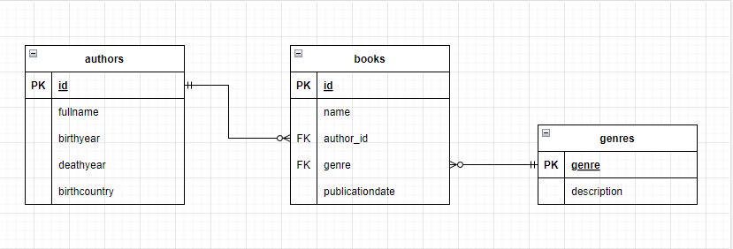

## Домашнее задание
Создать приложение хранящее информацию о книгах в библиотеке

### Цель:
Цель: использовать возможности Spring JDBC и spring-boot-starter-jdbc для подключения к реляционным базам данных
Результат: приложение с хранением данных в реляционной БД, которое в дальнейшем будем развивать

### Описание задания:
Это домашнее задание выполняется НЕ на основе предыдущего.

1. Использовать Spring JDBC и реляционную базу (H2 или настоящую реляционную БД). Настоятельно рекомендуем использовать NamedParametersJdbcTemplate
2. Предусмотреть таблицы авторов, книг и жанров.
3. Предполагается отношение многие-к-одному (у книги один автор и жанр). Опциональное усложнение - отношения многие-ко-многим (у книги может быть много авторов и/или жанров).
4. Интерфейс выполняется на Spring Shell (CRUD книги обязателен, операции с авторами и жанрами - как будет удобно).
5. Скрипт создания таблиц и скрипт заполнения данными должны автоматически запускаться
с помощью spring-boot-starter-jdbc.
6. Написать тесты для всех методов DAO и сервиса работы с книгами.
Рекомендации к выполнению работы:
7. НЕ делать AbstractDao.
8. НЕ делать наследования в тестах

Это домашнее задание является основой для следующих.

### Диаграмма таблиц

### Как пользоваться
* **dbconsole / dbc** \
открыть веб-консоль h2
* **showall / sa** \
напечатать все книги
* **showid / sid [id]** \
напечатать книгу по id \
Пример `showid 1`
* **add / a [bookname, authorname, genre]** \
добавить книгу с указанными полями. Все поля обязательные \
Пример `add 'Book name' 'Author full name', 'Some genre'`
* **edit / e [id, bookname, authorname, genre]** \
редактировать книгу по ид. id обязательно, остальные поля опциональны \
Пример: `edit 1 'New name' 'New full name', 'New genre'`
* **delete / d [id]** \
удалить книгу по id \
Пример `delete 1`

