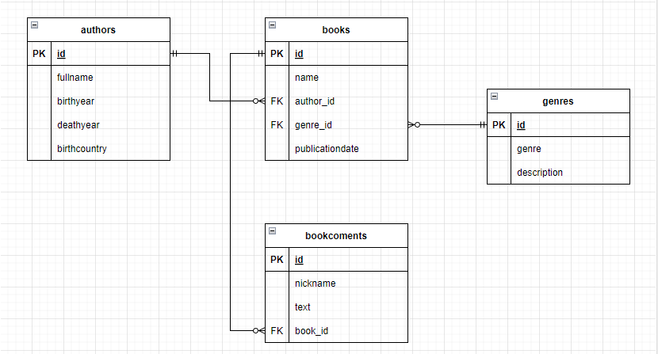

## Домашнее задание
Переписать приложение для хранения книг на ORM

### Цель:
Цель: полноценно работать с JPA + Hibernate для подключения к реляционным БД посредством ORM-фреймворка
Результат: Высокоуровневое приложение с JPA-маппингом сущностей

### Описание задания:
Домашнее задание выполняется переписыванием предыдущего на JPA.
Требования:

1. Использовать JPA, Hibernate только в качестве JPA-провайдера.
2. Для решения проблемы N+1 можно использовать специфические для Hibernate аннотации @Fetch и @BatchSize.
3. Добавить сущность "комментария к книге", реализовать CRUD для новой сущности.
4. Покрыть репозитории тестами, используя H2 базу данных и соответствующий H2 Hibernate-диалект для тестов.
5. Не забудьте отключить DDL через Hibernate
6. @Transactional рекомендуется ставить только на методы сервиса.
Это домашнее задание будет использоваться в качестве основы для других ДЗ
Данная работа не засчитывает предыдущую!

### Диаграмма таблиц

### Как пользоваться
* **dbconsole / dbc** \
открыть веб-консоль h2
* **showall / sa** \
напечатать все книги
* **showid / sid [id]** \
напечатать книгу по id \
Пример `showid 1`
* **add / a [bookname, authorname, genre]** \
добавить книгу с указанными полями. Все поля обязательные \
Пример `add 'Book name' 'Author full name', 'Some genre'`
* **edit / e [id, bookname, authorname, genre]** \
редактировать книгу по ид. id обязательно, остальные поля опциональны \
Пример: `edit 1 'New name' 'New full name', 'New genre'`
* **delete / d [id]** \
удалить книгу по id \
Пример `delete 6`
* **comment / d [bookId, nickName, text]** \
добавить комментарий к книге \
Пример `comment 1 'user' 'Новый коммент к книге 1'`
* **editcom / ecom [id, text]** \
редактировать комментарий по ид \
Пример `editcom 1 'Редактированный коммент к книге 1'`
* **showcom / scom [bookId]** \
напечатать все комментарии по книге \
Пример `showcom 1`
* **delcom / dcom [bookId]** \
удалить все комментарии по книге \
Пример `delcom 1`

